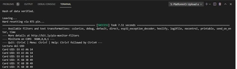

Pol Naharro
## PRACTICA 6 : Buses de comunicación II (SPI)
##### Ejercicio Practico 2 LECTURA DE ETIQUETA RFID

##### Código 

```
#include <Arduino.h>

#include <SPI.h>
#include <MFRC522.h>

#define RST_PIN	21    //Pin 9 para el reset del RC522
#define SS_PIN	15   //Pin 10 para el SS (SDA) del RC522
MFRC522 mfrc522(SS_PIN, RST_PIN); //Creamos el objeto para el RC522

void setup() {
	Serial.begin(9600); //Iniciamos la comunicación  serial
	SPI.begin(14,12,13,15);        //Iniciamos el Bus SPI
	mfrc522.PCD_Init(); // Iniciamos  el MFRC522
	Serial.println("Lectura del UID");
}

void loop() {
	// Revisamos si hay nuevas tarjetas  presentes
	if ( mfrc522.PICC_IsNewCardPresent()) {  
  		//Seleccionamos una tarjeta
        if ( mfrc522.PICC_ReadCardSerial()){
            // Enviamos serialemente su UID
            Serial.print("Card UID:");
            for (byte i = 0; i < mfrc522.uid.size; i++) {
                Serial.print(mfrc522.uid.uidByte[i] < 0x10 ? " 0" : " ");
                Serial.print(mfrc522.uid.uidByte[i], HEX);   
              } 
            Serial.println();
            // Terminamos la lectura de la tarjeta  actual
            mfrc522.PICC_HaltA();         
            }      
	}	
}
```
##### Explicación:
En esta práctica utilizamos el lector RFID para detectar dos tipos de tarjetas.
Primero crearemos el objeto para el lector RC522.
```
MFRC522 mfrc522(SS_PIN, RST_PIN);
```
A continuación iniciaremos el Serial, SPI y mfrc522 en el setup.
```
Serial.begin(9600); 
SPI.begin(14,12,13,15);
mfrc522.PCD_Init(); 
```
Más adelante en el loop crearemos un if con la siguiente instrucción para que continúe si hay una tarjeta presente.
```
mfrc522.PICC_IsNewCardPresent()
```
Seleccionamos la tarjeta y la leemos y mostramos por pantalla la información de esta. 
```
if ( mfrc522.PICC_ReadCardSerial()) {
    Serial.print("Card UID:");
    for (byte i = 0; i < mfrc522.uid.size; i++) {
        Serial.print(mfrc522.uid.uidByte[i] < 0x10 ? " 0" : " ");
        Serial.print(mfrc522.uid.uidByte[i], HEX);   
} 
Serial.println();
```
Terminamos la lectura de la tarjeta que se está leyendo.
```
mfrc522.PICC_HaltA();
```

##### Funcionamiento de la práctica:

Comprobación:

